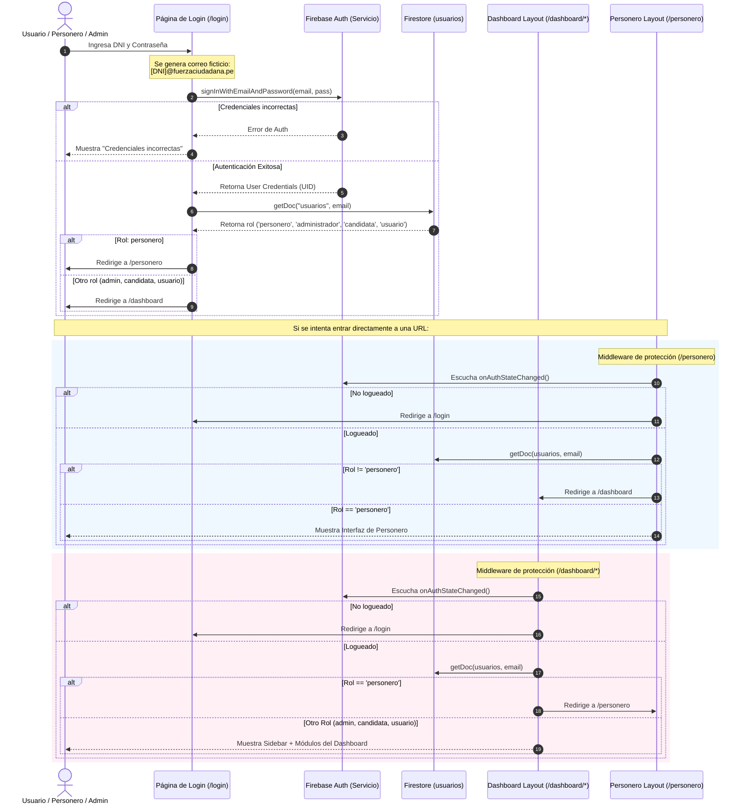

# Flujo de Autenticación, Redirección y Roles

Este documento detalla el mapa técnico y la arquitectura del sistema de login y control de accesos para la campaña de Karen Acevedo.

---

## 1. Diagrama de Flujo (Secuencia de Autenticación y Redirección)

El siguiente gráfico en formato **Mermaid** describe paso a paso cómo se autentica un usuario y cómo los Route Guards protegen y derivan cada vista.

---

## 2. Mapa de Archivos Clave

1. **[`src/app/login/page.tsx`](file:///c:/Users/KEVIN%20AVALOS/Webs/karen/web-campana/src/app/login/page.tsx)**:
   * Convierte el DNI del formulario a un formato de correo sintético compatible con Firebase: `${dni}@fuerzaciudadana.pe`.
   * Realiza la llamada a `signInWithEmailAndPassword`.
   * Hace la consulta inicial del rol a Firestore y despacha la redirección inicial.
2. **[`src/app/dashboard/layout.tsx`](file:///c:/Users/KEVIN%20AVALOS/Webs/karen/web-campana/src/app/dashboard/layout.tsx)**:
   * Protege todas las sub-rutas `/dashboard/*`.
   * Expulsa a usuarios desautenticados hacia `/login`.
   * Expulsa a usuarios con rol `personero` hacia `/personero`.
3. **[`src/app/personero/layout.tsx`](file:///c:/Users/KEVIN%20AVALOS/Webs/karen/web-campana/src/app/personero/layout.tsx)**:
   * Protege la sub-ruta `/personero`.
   * Expulsa a usuarios desautenticados hacia `/login`.
   * Expulsa a usuarios con otros roles (admin/candidata/usuario) hacia `/dashboard`.
4. **[`src/lib/firebase/user-service.ts`](file:///c:/Users/KEVIN%20AVALOS/Webs/karen/web-campana/src/lib/firebase/user-service.ts)**:
   * Modifica y estandariza la creación de usuarios para que todos compartan la estructura de datos unificada en Firestore.

---

## 3. Matriz de Permisos (Role-Based Access Control)

| Rol | Ruta Destino | Permisos del Módulo |
| :--- | :--- | :--- |
| **Administrador** | `/dashboard` | Acceso completo (Voluntarios, Control Electoral, Personeros, Configuración, Gestión de Accesos). |
| **Candidata** | `/dashboard` | Acceso de supervisión (Lectura de Voluntarios, Control Electoral y Personeros). Sin permisos de edición de accesos. |
| **Usuario** | `/dashboard` | Acceso mínimo (Solo visualización de Voluntarios para llamadas). |
| **Personero** | `/personero` | Acceso a interfaz móvil (Ingresar resultados de su mesa asignada y capturar foto del acta). |
